<div align="center">
  
<p align="center">
  
</p>


<br/>


<br/><br/>


</div>

<br/>

## Profile

```
> whoami

Computer Science undergraduate (AI/ML), Sandip University, Nashik
Focused on agentic AI systems, multi-agent architectures, and applied ML
Organizer of large-scale hackathons — SUNHACKS 2025, Push & Pool Villathon
Active contributor to NEST (Nashik Ecosystem for Startups & Technology)
30+ national hackathons competed
```

I design and ship systems where multiple AI agents reason, retrieve, and act together — from voice-driven workflow automation to retrieval-augmented platforms built for real organizations. My work sits at the intersection of applied machine learning, backend architecture, and product design.

<br/>

## Technical Stack

<div align="center">

**Languages**
<br/>


**AI / ML / Agentic Systems**
<br/>


**Backend & Data**
<br/>


**Frontend**
<br/>


**Infrastructure**
<br/>


</div>

<br/>

## Experience

<table>
<tr>
<td width="100%">

**Software Engineering Intern** — Cognifyz / Edunet Foundation (AICTE)

Built interactive React dashboards backed by real-time Node.js APIs; deployed machine learning models to production using Flask and Docker; operated within Agile sprint cycles and maintained CI/CD pipelines via GitHub Actions.

</td>
</tr>
</table>

<br/>

## Featured Systems

<div align="center">
<br/>
<sub>Simplified request path from SanjeevaniX — voice intake through retrieval, reasoning, orchestration, and response.</sub>
</div>

<br/>

<table>
<tr>
<td width="50%" valign="top">

**SanjeevaniX**
<br/>
AI-powered blood donor–patient matching platform, built in partnership with the NGO Blood Warriors.

- Multi-agent architecture with LangChain and RAG pipelines
- Vapi voice agents for donor outreach
- Pinecone vector search, Redis caching, PostgreSQL persistence
- n8n workflow orchestration across six role-specific dashboards

`LangChain` `Pinecone` `n8n` `Vapi` `Redis` `PostgreSQL`

</td>
<td width="50%" valign="top">

**NayaMarg**
<br/>
AI-powered employment platform with semantic search and multi-agent architecture.

- Semantic job–candidate matching
- Multi-agent task decomposition
- Scalable retrieval architecture

`Python` `Semantic Search` `Multi-Agent Systems`

</td>
</tr>
<tr>
<td width="50%" valign="top">

**Blood Monitoring System**
<br/>
AI-driven blood inventory management system for hospital networks.

- Shortage prediction using machine learning
- Blockchain-based transparency layer
- Automated hospital alerting

`Python` `Machine Learning` `Blockchain`

</td>
<td width="50%" valign="top">

**AI Financial Narrative Generator**
<br/>
Converts raw financial data into structured, readable market insight.

- Automated financial report generation
- Market sentiment analysis
- Probabilistic trade signal modeling

`Python` `NLP` `Data Pipelines`

</td>
</tr>
</table>

<br/>

## Community & Events

<table>
<tr>
<td width="100%">

**Organizer, SUNHACKS 2025** — one of the largest student hackathons in the region, recognized with an Asia Book of Records entry.

**Organizer, Push & Pool: 24-Hour Villathon** — hackathon under the NEST banner.

**Contributor, NEST (Nashik Ecosystem for Startups & Technology)** — supporting founders and technical innovators building in Nashik.

</td>
</tr>
</table>

<br/>

## Achievements

| Competition | Result |
|---|---|
| NASA Space Apps Challenge | Top 10 |
| SUNHACKS | Asia Book of Records |
| Hack2Infinity | Winner |
| Hackprix | Winner |
| AI for Good | Winner |
| Smart India Hackathon | Internal Winner |
| IIT Bhubaneswar ML Hackathon | Finalist |
| KJSSE Hack 8 | Top 20 |
| Kumbhathon | Team Lead |

<br/>

## Analytics

<div align="center">


<br/>


<br/>


<br/>


</div>

<br/>

## Contact

<div align="center">

<a href="https://www.linkedin.com/in/ansh-rajore">

</a>
<a href="mailto:anshrajore1266@gmail.com">

</a>
<a href="https://github.com/anshrajore">

</a>

<br/><br/>

<sub>Systems that reason, retrieve, and act — built one agent at a time.</sub>

</div>
